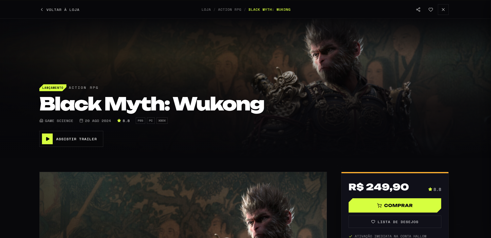
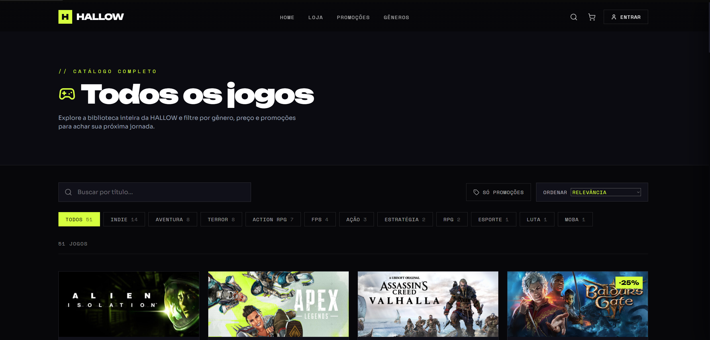

# HALLOW — Game Store

Loja de jogos fictícia full-stack: vitrine em **React 19 + Vite + Tailwind** com um
backend **Node (Express) + SQLite** que cobre catálogo, autenticação (user/admin),
biblioteca do usuário e pedidos.

**🔗 Demo:** [gamestore-amber-rho.vercel.app](https://gamestore-amber-rho.vercel.app)

## Screenshots







## Stack

| Camada    | Tecnologias                                                        |
|-----------|--------------------------------------------------------------------|
| Front     | React 19, Vite, Tailwind 3, React Router, lucide-react             |
| Back      | Node + Express, SQLite (better-sqlite3), JWT, bcryptjs             |

## Pré-requisitos

- **Node 20+** (testado no Node 24).

## Rodando o projeto

```bash
npm install              # instala front + back

# 1) Configure o ambiente
cp .env.example .env      # e ajuste o JWT_SECRET (veja abaixo)

# 2) Suba front + back juntos
npm run dev:full          # web (Vite :5173) + api (Express :3001)
```

### Scripts

| Script              | O que faz                                            |
|---------------------|------------------------------------------------------|
| `npm run dev`       | só o front (Vite)                                    |
| `npm run dev:server`| só a API (Node, com `--watch`)                       |
| `npm run dev:full`  | front + API juntos                                   |
| `npm run seed`      | popula o banco (catálogo + admin) manualmente        |
| `npm run build`     | build de produção do front em `dist/`                |
| `npm run lint`      | ESLint                                               |

## Banco de dados

SQLite em `server/data/hallow.db` (gitignored). No primeiro boot, o servidor roda o
**seed** automaticamente: importa o catálogo de `src/data/gamesData.js` (~50 jogos) e
cria um usuário admin. Para recriar do zero, apague o arquivo `.db` e rode `npm run seed`.

**Admin padrão:** `admin@hallow.gg` / `admin123` (mude no `.env` antes do primeiro seed).

O front tem uma camada de dados que alterna entre o backend real e um mock em
localStorage, controlada pela flag de build `VITE_MOCK`:

| Cenário | Comando | Dados |
|---------|---------|-------|
| **Local / GitHub** (full-stack) | `npm run dev:full` | API Express + SQLite reais |

- Em **dev** a flag fica desligada → tudo bate na API real (auth/JWT, admin, biblioteca,
  pedidos). É assim que quem clona o repo testa o backend.
  `admin@hallow.gg` / `admin123`.

## API

| Método | Rota                | Acesso  | Descrição                          |
|--------|---------------------|---------|------------------------------------|
| POST   | `/api/auth/register`| público | cria conta, devolve JWT            |
| POST   | `/api/auth/login`   | público | login, devolve JWT                 |
| GET    | `/api/auth/me`      | logado  | dados do usuário do token          |
| GET    | `/api/games`        | público | catálogo                           |
| GET    | `/api/games/:id`    | público | detalhe                            |
| POST   | `/api/games`        | admin   | cria jogo                          |
| PUT    | `/api/games/:id`    | admin   | edita jogo                         |
| DELETE | `/api/games/:id`    | admin   | remove jogo                        |
| POST   | `/api/orders`       | logado  | finaliza compra (checkout mockado) |
| GET    | `/api/orders`       | logado  | histórico de pedidos               |
| GET    | `/api/library`      | logado  | jogos que o usuário possui         |

## Estrutura

```
src/            front React (páginas em src/pages, dados em src/data)
server/         API Express
  index.js      bootstrap + rotas
  db.js         conexão SQLite + schema
  auth.js       bcrypt + JWT (← implementar) + middlewares
  seed.js       catálogo + admin inicial
  routes/       auth, games, orders, library
```
